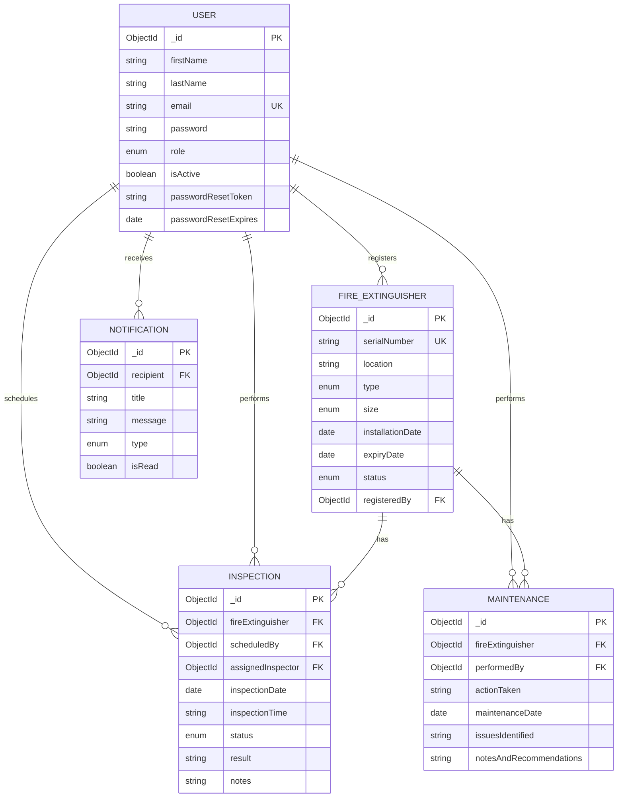

# FEMS Database Design (MongoDB)

## Entity Relationship Diagram

## Collections & Indexes

| Collection | Unique Constraints | Indexes |
|------------|-------------------|---------|
| users | email | email, role |
| fireextinguishers | serialNumber | serialNumber, status, expiryDate, location |
| inspections | — | fireExtinguisher, inspectionDate+status, status |
| maintenances | — | fireExtinguisher, maintenanceDate |
| notifications | — | recipient, isRead, createdAt |

## Microservice Data Ownership

| Service | Collections |
|---------|-------------|
| User Management / Auth | users |
| Fire Extinguisher Management | fireextinguishers |
| Inspection & Maintenance | inspections, maintenances |
| Notification | notifications |
| Reporting | read-only aggregates across all |
